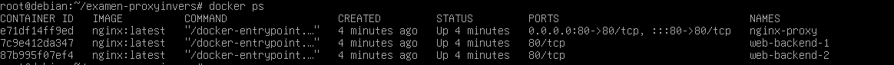
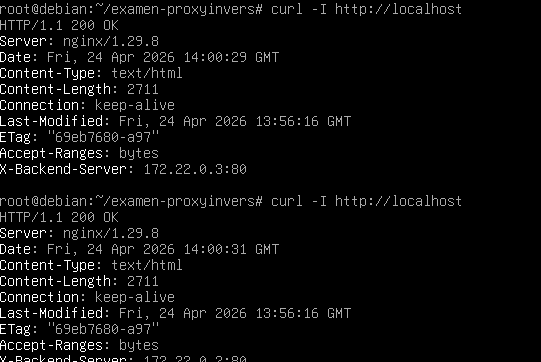
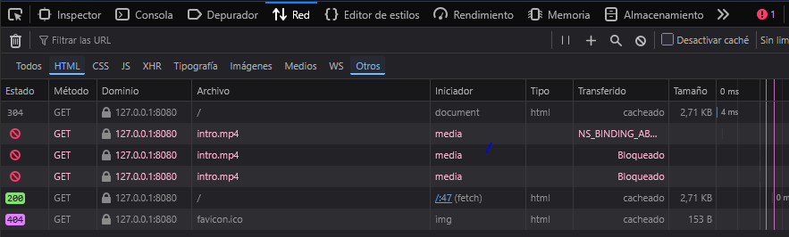

# Infraestructura Web con Proxy Inverso y Balanceo de Carga

Este proyecto despliega una infraestructura web robusta utilizando Docker Compose, con un proxy inverso Nginx que distribuye el tráfico entre dos backends idénticos.

## 🏗️ Arquitectura del Sistema

```text
                                     +--------------------------+
                                     |      Red Externa         |
                                     |      (Puerto 80 Host)    |
                                     +------------+-------------+
                                                  |
                                                  v
                                     +------------+-------------+
                                     |   Proxy Inverso (Nginx)  |
                                     |   (Contenedor: proxy)    |
                                     +------------+-------------+
                                                  |
                          +-----------------------+-----------------------+
                          |                                               |
                          v                                               v
            +-------------+-------------+                   +-------------+-------------+
            |      Backend 1 (Nginx)    |                   |      Backend 2 (Nginx)    |
            |    (Contenedor: web1)     |                   |    (Contenedor: web2)     |
            +-------------+-------------+                   +-------------+-------------+
                          |                                               |
                          +-----------------------+-----------------------+
                                                  |
                                                  v
                                     +------------+-------------+
                                     |      Volumen Compartido  |
                                     |      (Contenido Web)     |
                                     +--------------------------+
```

## 🛠️ Decisiones de Diseño

1.  **Imágenes Oficiales**: Se ha utilizado la imagen oficial `nginx:latest`. Nginx es el estándar de la industria para proxies inversos por su eficiencia y facilidad de configuración para el balanceo de carga.
2.  **Aislamiento de Red**: Se ha definido una red Docker personalizada llamada `proxy_network`. Los backends (`web1` y `web2`) solo están conectados a esta red y **no exponen ningún puerto al host**. El único punto de entrada es el contenedor `proxy` en el puerto 80.
3.  **Balanceo de Carga**: Se utiliza el método predeterminado (Round-Robin) definido en el bloque `upstream`. Esto garantiza una distribución equitativa de las peticiones.
4.  **Identificación de Backends**: Se ha configurado la cabecera `X-Backend-Server` que devuelve la dirección IP interna del contenedor que ha respondido, permitiendo verificar el funcionamiento del balanceo.
5.  **Volumen Compartido**: Se utiliza un volumen de tipo bind-mount para la carpeta `./www`. Esto permite que ambos backends sirvan exactamente el mismo contenido y facilita las actualizaciones en tiempo real sin reiniciar los contenedores.

## 🚀 Comandos para el Entorno

### Levantar la infraestructura
```bash
docker compose up -d
```

### Verificar el funcionamiento
```bash
# Comprobar que los contenedores están funcionando
docker compose ps

# Verificar el balanceo de carga y las cabeceras (repetir varias veces)
curl -I http://localhost
```

### Detener el entorno
```bash
docker compose down
```

## 📸 Capturas de Verificación

### 1. Estado de los Contenedores
Demostración de que la infraestructura está activa y los puertos están correctamente configurados.
> **Comando:** `docker compose ps`
> ![Estado Contenedores]!

### 2. Funcionamiento del Balanceo (Round-Robin)
Prueba técnica que muestra cómo el Proxy Inverso alterna entre los dos backends.
> **Comando:** `curl -I http://localhost` (repetido)
> ![Prueba Balanceo]
> [alt text](image-1.2.png)

### 3. Vista de la Interfaz Web
> ![Interfaz Web]

### 4. Cabeceras HTTP (Herramientas de Desarrollador)
> ![Cabeceras HTTP]
